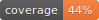

## Whatsapp Reminders

Programatic reminders for whatsapp.




### Stack

* [Django](https://www.djangoproject.com/) as main web Framework
* [Django Rest Framework](http://www.django-rest-framework.org/) as API development tooling
* [Postgres](http://www.django-rest-framework.org/) for SQL Database
* [Redis](http://redis.io/) for caching and memoizations.
* [Docker / docker-compose](http://www.django-rest-framework.org/) for development and standalone deployments.

## Getting started

### Backend

You need to have installed `git`, `docker`, `ssh` and a decent `terminal`.

1. `make build` to build docker image of the repo.
2. `make fixtures` to populate database (optional).
3. `make up` run development container and open http://localhost:8000 in the browser.
4. `make debug` to run container in debug mode

Probably you need to user the following command for another situations.

* `make django` to enable `debug` mode during development.
* `make migrations` run django makemigrations command
* `make migrate` run django migrate command
* `make superuser` make a superuserfor develoment


#### Translation

* `make locales` generate translation strings.
* `localhost:8000/rosetta/` complete strings in other languages.
* `make compile_locales` compile translation strings.


### Testing

* `make test` run pytest over all test files in the project
* `make test ARG=path_to_file` run pytest of a single test file.

### Code Quality

Recurring commands:

* `make coverage` run pytest and generate the coverage report.
* `make lint` run flake8 and generate linting report.
* `make report_coverage` serves the coverage report as html at `localhost:3000`
* `make report_lint` serves the lint report as html at `localhost:3001`

Composed commonly used command:

```
make review
```

### How to test reminders

To test reminders you need try using the postman collection.
